#### 店铺：Anasweeney模块批发 [https://shop172522687.taobao.com](https://shop172522687.taobao.com)  
|图片|宝贝名称|链接|价格|
|---|-------|---|---|
|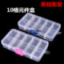|IC贴片零件盒 电子元件盒 收纳盒 储物盒 可拆分10格|https://item.taobao.com/item.htm?id=577430850714&_u=3pq19bb|¥1.50|
|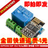|ESP8266 ESP-01S Relay模块 继电器 WIFI 智能插座 加多ESP-01S|https://item.taobao.com/item.htm?id=576954709017&_u=3pq29af|¥3.00(¥3.70)|
|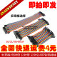|40P彩色杜邦线 母对母 公对母 公对公头 40根一排 10//21/30/40CM|https://item.taobao.com/item.htm?id=557052387490&_u=3pq88c2|¥1.45|
|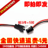|SM对插线 2P对插连接线 间距2.54MM 空中对插公母线各长10CM 5对|https://item.taobao.com/item.htm?id=562526570343&_u=3pqacbc|¥3.00|
|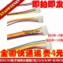|XH2.54电子线单头镀锡彩排线连接线2位/3/4/5/6/7/8/9/10P 长30CM|https://item.taobao.com/item.htm?id=574774751205&_u=3pq0080|¥1.80|
|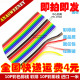|10P彩色排线 彩排 10P彩排线 进口 一米|https://item.taobao.com/item.htm?id=565411466074&_u=3pq105c|¥1.70|
|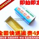|特级松香 高级助焊剂 焊油 纸盒装高纯度松香 焊接辅助工具 15克|https://item.taobao.com/item.htm?id=562944087788&_u=3pq5682|¥0.75|
|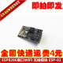|ESP8266串口WIFI 无线模块 WIF收发无线模块 ESP-01|https://item.taobao.com/item.htm?id=562527278312&_u=3pqae4b|¥6.25|
|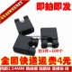|间距2.54MM 跳线帽 短路块 连接块 排针连接块 开口（100个）|https://item.taobao.com/item.htm?id=562931836835&_u=3pq8691|¥2.00|
|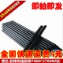|黑色 胶棒 胶条 热熔胶 热熔胶棒 细棒 细胶棒 7MM*270MM长|https://item.taobao.com/item.htm?id=563377800296&_u=3pq7d10|¥0.60|
|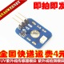|UV紫外线传感器模块 紫外线检测模块 紫外线|https://item.taobao.com/item.htm?id=562395637531&_u=3pqb38c|¥14.00|
|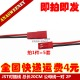|JST对插线 总长20CM 公母线一对 2P对插线 模型 玩具等电源连接线|https://item.taobao.com/item.htm?id=562624369242&_u=3pq026a|¥2.60|
|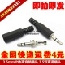|3.5mm立体声音频插头 3.5双声道插头 3.5耳机音频插头 5个|https://item.taobao.com/item.htm?id=563115925813&_u=3pq92c2|¥1.75|
|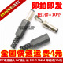|DC电源插头 DC插头 长 5.5-2.1MM 焊线式(10个)|https://item.taobao.com/item.htm?id=568181934403&_u=3pq5fd7|¥3.50|
|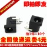|DC-005直流电源插座 5.5-2.1MM/2.5MM 耐高温电源插座（10个）|https://item.taobao.com/item.htm?id=571514010003&_u=3pq2439|¥1.00(¥1.80)|
|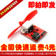|L9110电机驱动风扇模块 传感器模块 灭火机器人单片机开发板|https://item.taobao.com/item.htm?id=606106739594&_u=3pq5f8f|¥8.50(¥9.00)|
|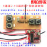|4通道2.4G无线遥控接收器套装 玩具车模船模DIY遥控配件TR100|https://item.taobao.com/item.htm?id=583681727107&_u=3pqfcbb|¥1.00|
|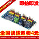|16路PWM Servo 舵机驱动板机器人控制器IIC接口驱动器模块PCA9685|https://item.taobao.com/item.htm?id=601096736244&_u=3pq3fdd|¥8.60(¥10.20)|
|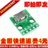|MICRO USB转Dip 母座B型 迈克5p 贴片转直插 转接板 已焊接 母头|https://item.taobao.com/item.htm?id=562771202773&_u=3pqae6c|¥0.18(¥0.30)|
|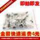|17种直插三极管包 TO-92常用电子元件包 PNP NPN 每种10个共170个|https://item.taobao.com/item.htm?id=574616086354&_u=3pqfc49|¥8.60(¥9.00)|
|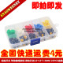|轻触开关按键圆形 带按键帽按钮 微动开关12*12*7.3MM 25PCS盒装|https://item.taobao.com/item.htm?id=588140211597&_u=3pq07f9|¥4.30(¥4.60)|
|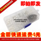|PH2.0 2P3P4P5P针 间距2.0MM 端子套件外壳针座JST连接器总230PCS|https://item.taobao.com/item.htm?id=590415770299&_u=3pqc988|¥7.80|
|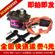|MG90S 铜齿（9g尺寸）全金属齿轮 14g 倾斜舵机 SG90升级版|https://item.taobao.com/item.htm?id=601102082276&_u=3pq9d10|¥6.60(¥7.10)|
|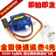|经典舵机 SG90 9g舵机 固定翼航模遥控飞机 9克 航模 兼容Arduino|https://item.taobao.com/item.htm?id=562545135533&_u=3pq0391|¥1.50|
|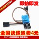|DHT11温度模块 湿度模块板 温湿度模块 DTH11传感器板 送4P杜邦线|https://item.taobao.com/item.htm?id=558113775756&_u=3pqbcf0|¥3.35(¥3.98)|
|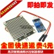|高灵敏雨滴雨水控制器模块 下雨感知模块 雨水叶面传感模块|https://item.taobao.com/item.htm?id=558115395726&_u=3pq61c0|¥1.10(¥1.75)|
|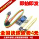|土壤湿度计检测模块 土壤湿度传感器 机器人 智能小车|https://item.taobao.com/item.htm?id=557913888406&_u=3pq777d|¥1.58|
|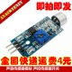|声音传感器 声音检测模块 咪头模块 声控口哨开关 声音模块|https://item.taobao.com/item.htm?id=558114559417&_u=3pq728f|¥0.73(¥1.38)|
|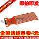|水位传感器 for 水分 液滴 水深检测|https://item.taobao.com/item.htm?id=582875310656&_u=3pq98cb|¥0.64(¥0.72)|
|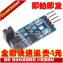|新款 测速传感器模块 计数器模块 电机测试模块 槽型光耦模块|https://item.taobao.com/item.htm?id=563313284016&_u=3pqc98c|¥0.86(¥1.35)|
|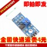|干簧管传感器模块 磁控管模块 干簧管开关 磁控开关|https://item.taobao.com/item.htm?id=558114255521&_u=3pqc24c|¥0.95(¥1.65)|
||GY-63 MS5611-01BA03 气压传感器模块 高精度 高度传感器模块|https://item.taobao.com/item.htm?id=578997354780&_u=3pqe61a|¥20.40(¥22.80)|
|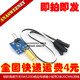|热销促销倾斜角度开关SW520D感应传感器小板带2条20CM杜邦线|https://item.taobao.com/item.htm?id=585394526299&_u=3pq93ff|¥1.00(¥1.08)|
|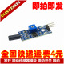|常开型 振动传感器模块 震动开关 震动传感器 报警器模块|https://item.taobao.com/item.htm?id=562360497639&_u=3pqcb51|¥1.25|
|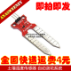|土壤湿度传感器 自动浇花系统|https://item.taobao.com/item.htm?id=607141684329&_u=3pq4e91|¥0.50(¥1.10)|
|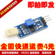|湿度传感器模块　HR202 湿度模块　湿度检测　湿度开关 HR202L|https://item.taobao.com/item.htm?id=557909973157&_u=3pq7dbc|¥2.00(¥2.78)|
|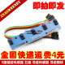|5路循迹传感器 五路 寻迹传感器 寻迹模块 红外传感器 tcrt5000l|https://item.taobao.com/item.htm?id=583335211330&_u=3pqeb05|¥5.20(¥6.20)|
|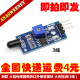|新款 火焰传感器模块 火源探测模块 红外接收模块 火光检测|https://item.taobao.com/item.htm?id=584720054118&_u=3pq6f77|¥1.20|

#### 店铺：欣薇电子科技 [https://shop145671653.taobao.com](https://shop145671653.taobao.com)  
|图片|宝贝名称|链接|价格|
|---|-------|---|---|
|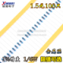|1%金属膜电阻 1/4W直插0.25w 1Ω 10欧100R 1K 10K 100KΩ 1M 10M|https://item.taobao.com/item.htm?id=528027921298&_u=3pq520d|¥1.50|
|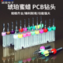|PCB钻头 钨钢钻头 雕刻钻头 微型小钻头 琥珀蜜蜡手捻钻打孔|https://item.taobao.com/item.htm?id=547737765192&_u=3pq081b|¥1.20|
|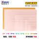|单面/双面 玻纤覆铜板5*7*10*15*12*18*20cm 实验板PCB电路板FR-4|https://item.taobao.com/item.htm?id=527525457435&_u=3pqf92f|¥0.33|
|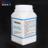|蓝色环保蚀刻剂 PCB专用蚀刻粉 腐蚀剂 替代三氯化铁 PCB覆铜板用|https://item.taobao.com/item.htm?id=540644659518&_u=3pq794c|¥2.18(¥2.78)|
|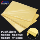|PCB热转印纸 A4大小 A4纸 DIY 电路板热转印纸 黄色 加厚|https://item.taobao.com/item.htm?id=540646003614&_u=3pq27ae|¥1.99(¥2.99)|
||六角双通铜柱 M3*5/6/8/10/12/15/20/25/30/35/40/45/50/55/60mm|https://item.taobao.com/item.htm?id=527532290904&_u=3pq0447|¥1.03|
|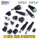|DC电源插头插座 002/005 012 022AB 3.5-1.1/1.3  5.5-2.1MM 直流|https://item.taobao.com/item.htm?id=528137679840&_u=3pqf618|¥0.06|
|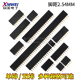|单排双排母座2.54mm排针插座排母1*2P3P4P5P6P7P8P9P10P16P20P40P|https://item.taobao.com/item.htm?id=528138243564&_u=3pqc524|¥0.05|
|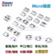|Micro USB插座5P母座插脚贴片直插牛角麦克沉板卷边安卓V8口尾插|https://item.taobao.com/item.htm?id=562094505999&_u=3pqef54|¥0.11|
|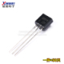|直插/贴片三极管 S9014 NPN型（TO-92）SOT-23 欣薇电子 电子元件|https://item.taobao.com/item.htm?id=541028077035&_u=3pqabc7|¥1.80|
|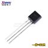|直插/贴片三极管 S9013 NPN型（TO-92） 丝印J3  SOT-23 欣薇电子|https://item.taobao.com/item.htm?id=541028281061&_u=3pq52ee|¥0.88|
|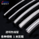|透明热缩管 电线绝缘收缩套管电工热塑管 1/2/3/4/5/6/7/8/10mm|https://item.taobao.com/item.htm?id=574998373137&_u=3pqb27e|¥0.15|
|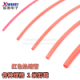|红色热缩管 电线绝缘收缩套管电工热塑管 1/2/3/4/5/6/7/8/10mm|https://item.taobao.com/item.htm?id=575103554733&_u=3pq4937|¥0.15|
|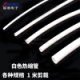|白色热缩管 电线绝缘收缩套管电工热塑管 1/2/3/4/5/6/7/8/10mm|https://item.taobao.com/item.htm?id=575211835867&_u=3pq43c0|¥0.15|
||蓝色热缩管 电线绝缘收缩套管电工热塑管 1/2/3/4/5/6/7/8/10mm|https://item.taobao.com/item.htm?id=575211335683&_u=3pq7994|¥0.15|
||18650电池盒 1/2/3/4节 并联 串联 带线 一/二/三/四节 锂电池盒|https://item.taobao.com/item.htm?id=542947985607&_u=3pq532c|¥0.96|
||GSM/GPRS弹簧天线加粗铜材螺旋线圈绕制天线GSM天线主板焊接全铜|https://item.taobao.com/item.htm?id=599900509839&_u=3pq4370|¥0.38|
||万能红外接收头 塑料 遥控接收管 0038一体化红外线接收器 vs0038|https://item.taobao.com/item.htm?id=558193928987&_u=3pqf918|¥0.28|
||彩色排线杜邦线 彩排线 10/14/16/20/26/34/40P 1.27间距兼容FC|https://item.taobao.com/item.htm?id=563020308044&_u=3pq246e|¥1.60|
||9V 电池扣/电池扣子 6F22电池座 T/I型 带引线 带插头 线长15cm|https://item.taobao.com/item.htm?id=563590749718&_u=3pqfbf3|¥0.15(¥0.25)|

#### 店铺：百顺电子 [https://shop71496636.taobao.com](https://shop71496636.taobao.com)  
|图片|宝贝名称|链接|价格|
|---|-------|---|---|
||USB移动电源免焊diy套件1节18650电池充电器DIY移动电源电池盒黑|https://item.taobao.com/item.htm?id=599453515480&_u=3pq84c8|¥1.48(¥1.98)|
||12首儿歌音乐模块YSJ12S双音12种英文音乐带LED闪烁模块宇思捷|https://item.taobao.com/item.htm?id=606719831747&_u=3pqa4e3|¥1.00(¥1.50)|
||配桨配座130电机 学生DIY风力车船风扇模型玩具马达螺旋桨配件|https://item.taobao.com/item.htm?id=608545644011&_u=3pq66b6|¥1.60(¥2.10)|
||四路红外探测 寻迹光电传感器 智能寻迹小车 循迹模块 黑白线识别|https://item.taobao.com/item.htm?id=597349823895&_u=3pq9ac2|¥4.20(¥4.70)|
||16路PWM Servo 舵机驱动板机器人控制器IIC接口驱动器模块PCA9685|https://item.taobao.com/item.htm?id=598112179541&_u=3pq76f3|¥8.30(¥9.80)|
||简易舵机测试仪 舵机测试器 航模马达测试电调测试器三档指示灯|https://item.taobao.com/item.htm?id=609329679041&_u=3pqbef2|¥3.20(¥4.20)|
||0.96寸 蓝色 白色 黄蓝双色 IIC通信 小OLED显示屏模块 51单片机|https://item.taobao.com/item.htm?id=592705152552&_u=3pq4c6d|¥8.70(¥9.20)|
||无源蜂鸣器 电磁式 12085 阻抗16欧 交流/2KHz 3V 5V 9V 12V通用|https://item.taobao.com/item.htm?id=599702676548&_u=3pq8483|¥0.11(¥0.21)|
||智能小车底盘 机器人轮胎+直流减速电机 套装 车轮 轮子 马达|https://item.taobao.com/item.htm?id=598636933056&_u=3pqbae6|¥2.24(¥2.74)|
||Nano V3.0 CH340改进版 Atmega328P USB转TTL 带USB线|https://item.taobao.com/item.htm?id=597990036571&_u=3pq158a|¥12.00(¥12.50)|
||Pro Micro 采用Atmega32U4 自身usb更新程序 5V/16M 单片机开发板|https://item.taobao.com/item.htm?id=597619913897&_u=3pq9b82|¥16.30(¥16.80)|
||SG90 9G舵机 450 固定翼 直升机 正版QC标 现货 航机 已到现货|https://item.taobao.com/item.htm?id=592915294894&_u=3pq742b|¥3.40(¥3.90)|

#### 店铺：立华电子 [https://shop36387482.taobao.com](https://shop36387482.taobao.com)  
|图片|宝贝名称|链接|价格|
|---|-------|---|---|
||N20微型减速电机 DC3V-6V直流马达 纯钢金属齿轮减速|https://item.taobao.com/item.htm?id=577038176148&_u=3pqee8c|¥0.98(¥1.30)|
||3.7v聚合物锂电池行车记录仪蓝牙耳机导航仪3D眼镜小玩具带保护板|https://item.taobao.com/item.htm?id=592132479541&_u=3pq4f78|¥0.90(¥1.50)|
||小喇叭全新原装微鲸电视机小音箱DIY条形功放配件扬声器8欧8w一对|https://item.taobao.com/item.htm?id=601465403288&_u=3pq1a56|¥2.90(¥3.90)|
||水流传感器霍尔水流量开关售水机涡轮流量计自动控制限制水量|https://item.taobao.com/item.htm?id=599485605081&_u=3pq312f|¥3.50|

#### 店铺：森德立木制品 [https://shop64758925.taobao.com](https://shop64758925.taobao.com)  
|图片|宝贝名称|链接|价格|
|---|-------|---|---|
||2mm密度板60x40cm可定制学用板钢丝画板相框背板多用板|https://item.taobao.com/item.htm?id=599928073730&_u=3pq4a7b|¥11.00|
||5mm密度板60x40厘米学用板钢丝画板多用可定制|https://item.taobao.com/item.htm?id=605096001564&_u=3pq4488|¥14.00|

#### 店铺：德晟泰科技 [https://shop154977244.taobao.com](https://shop154977244.taobao.com)  
|图片|宝贝名称|链接|价格|
|---|-------|---|---|
||mp3无损解码板 mp3解码器 TF卡 U盘 MP3解码播放器模块 自带功放|https://item.taobao.com/item.htm?id=537182516399&_u=3pq3c2d|¥2.65(¥4.55)|
||MP3蓝牙接收板 无损车载音箱功放板 改装diy音频接收器 4.1立体声|https://item.taobao.com/item.htm?id=574610656399&_u=3pq9a50|¥2.40(¥3.20)|
||L9110S 双通道 直流电机驱动模块 两路 步进电机驱动 电机驱动板|https://item.taobao.com/item.htm?id=537183004627&_u=3pq61f2|¥1.20(¥2.20)|
||钮子开关MTS-102/103/202/203 3脚/6脚两/三档 单/双联摇臂开关|https://item.taobao.com/item.htm?id=582810820781&_u=3pq7a3c|¥0.30(¥0.85)|
||KAN-28 强光手电筒开关1.5A250V 自锁 贴片式 18 x 12mm按钮开关|https://item.taobao.com/item.htm?id=545037648371&_u=3pqc482|¥0.20(¥0.25)|
||5V 激光头传感器模块 激光管 KY-008 激光模块 兼容arduino|https://item.taobao.com/item.htm?id=537032759968&_u=3pq72cb|¥0.65(¥1.28)|
||MB-102 优质面包板 线路板 实验板 万能板 830孔 165×55×10mm|https://item.taobao.com/item.htm?id=601568181756&_u=3pqb9ce|¥1.78(¥3.00)|
||高清ips 0.96寸1.3寸1.44寸1.8寸 TFT显示屏 OLED液晶屏 st7735|https://item.taobao.com/item.htm?id=596015539059&_u=3pq2c39|¥11.80|
||手扫感应开关模块 橱柜衣柜LED灯非触摸手扫开关模块 5V 12V 24V|https://item.taobao.com/item.htm?id=595782078593&_u=3pq4a0d|¥5.88(¥6.30)|
||3A可调降压模块 DC-DC 稳压电源 MP1584EN 超小体积 超LM2596|https://item.taobao.com/item.htm?id=592783355235&_u=3pqcd03|¥0.70(¥2.35)|
||3.7V升9V 5V 万用表改装18650锂电池充电升压放电一体可调模块2 A|https://item.taobao.com/item.htm?id=592448501808&_u=3pqd32d|¥3.05(¥3.50)|
||最新版 Arduino nano V3.0 ATMEGA328P 改进版超级好用 送USB线|https://item.taobao.com/item.htm?id=591971658338&_u=3pqd7fa|¥5.70(¥6.00)|
||pro micro扩展板5v/16M Leonardo单片机开发板 兼容arduino nano|https://item.taobao.com/item.htm?id=591749140403&_u=3pqa54a|¥17.20(¥17.50)|
||3.7V锂电池充电保护板模块 适用聚合物18650 可点焊多并3A过流值|https://item.taobao.com/item.htm?id=573440336718&_u=3pqfb0f|¥0.15(¥0.80)|
||微型 0.36寸数码管2.7V-32V两线可变精度数显示/数字电压表头|https://item.taobao.com/item.htm?id=589791810903&_u=3pq39f4|¥1.30(¥3.10)|
||UNO R3 开发板 ATmega328P 单片机 改进版 学习控制板兼容arduino|https://item.taobao.com/item.htm?id=589709596308&_u=3pq39d0|¥2.40(¥3.00)|
||USB充电电流/电压测试仪 检测器 USB电压表 电流表 可检测USB设备|https://item.taobao.com/item.htm?id=574126997567&_u=3pq994e|¥3.30(¥5.00)|
||超声波测距模块 HC-SR04 超声波传感器 支持Arduino/51/STM32|https://item.taobao.com/item.htm?id=567942138412&_u=3pq3fc3|¥1.75(¥3.30)|
||船型开关 电源开关 KCD1-101船型开关 单刀2档 6A 250V黑色 2脚|https://item.taobao.com/item.htm?id=542390390784&_u=3pq2825|¥0.11(¥0.29)|
||无铅电烙铁 焊接工具元器件 BEST倍思特 BST-813 电烙铁 60W|https://item.taobao.com/item.htm?id=549187425338&_u=3pqb375|¥29.88(¥30.00)|
||松香纯度高 电烙铁小提琴乐器电子焊接助焊膏焊锡助剂小盒装|https://item.taobao.com/item.htm?id=565823387760&_u=3pq2008|¥1.38(¥1.50)|
||168Z 维修固定带夹子 台式 放大镜 放大5倍 电子专用材料 芯片|https://item.taobao.com/item.htm?id=549125964894&_u=3pq1f82|¥15.80(¥17.00)|
||铜柱M3/4 单头六角铜柱 铜柱螺丝 六角隔离柱【铜柱系列】|https://item.taobao.com/item.htm?id=543614805938&_u=3pq777c|¥0.05(¥0.11)|
||散热片 40*40*11MM（黑色开槽）优质散热器|https://item.taobao.com/item.htm?id=542391206860&_u=3pq1d9f|¥1.30(¥1.50)|
||8*8MM 双排6脚/自锁电源开关/轻触/按钮/按键/带锁/8X8MM|https://item.taobao.com/item.htm?id=566715509671&_u=3pq2aab|¥0.15|
||优质扬声器 3W 4R 3瓦 4欧喇叭 迷你功放专用 橡皮胶边 直径4CM|https://item.taobao.com/item.htm?id=565774172196&_u=3pqb133|¥2.10(¥3.20)|
||SYB-170小板 实验板 迷你彩色面包板 可拼接面包板|https://item.taobao.com/item.htm?id=541072470626&_u=3pq6c28|¥0.45(¥0.75)|
||数控玻纤板 PCB 优质玻纤 9*15cm 厚度1.6 洞洞板 实验板 绿油板|https://item.taobao.com/item.htm?id=542136870838&_u=3pqe65f|¥2.69|
||散热片11*11*5.5 高5mm 电源模块散热器 IC散热叶 散热片带胶贴|https://item.taobao.com/item.htm?id=542366420608&_u=3pq6ddf|¥0.37|
||1X40PIN 40脚2.54mm单排针 长11.2mm单排直针接插件 黑红黄白绿蓝|https://item.taobao.com/item.htm?id=564356996978&_u=3pq4272|¥0.05(¥0.09)|
||杜邦线 母对母 公对母公对公40P彩色排线连接线10/15/30/20/40CM|https://item.taobao.com/item.htm?id=541994136117&_u=3pq666d|¥0.88(¥1.45)|
||经典舵机 SG90 9g舵机 固定翼航模遥控飞机 9克 航模 兼容Arduino|https://item.taobao.com/item.htm?id=537183164391&_u=3pqbf75|¥3.20(¥4.15)|
||MT3608 DC-DC升压模块2A升压板输入电压2-24V升5/9/12/-28V可调|https://item.taobao.com/item.htm?id=537032583769&_u=3pq88b8|¥0.72(¥1.52)|
||人体红外感应模块 完整版 HC-SR501 人体传感器 感应开关红外开关|https://item.taobao.com/item.htm?id=536760555155&_u=3pq5c99|¥3.18(¥4.00)|
||带探头 数显温度计/电子温度计/传感器/浴缸/冰箱温度计 2秒刷新|https://item.taobao.com/item.htm?id=536907492157&_u=3pq027d|¥2.20(¥3.30)|
||LM2596S DC-DC 降压电源模块BUCK 3A可调降压模块 稳压 超LM2576|https://item.taobao.com/item.htm?id=530332414706&_u=3pq188d|¥1.00(¥2.35)|
||新款 两轮智能小车底盘/机器人/寻迹小车/壁障/套件/带码盘|https://item.taobao.com/item.htm?id=537182556270&_u=3pq9d22|¥12.00(¥13.50)|
||超声波测距模块 HC-SR04 超声波传感器 支持兼容UNO R3/51/STM32|https://item.taobao.com/item.htm?id=575471153414&_u=3pq8b14|¥0.88(¥1.35)|
||土壤湿度计检测模块 土壤湿度传感器模块 4线土壤湿度计 智能小车|https://item.taobao.com/item.htm?id=536870121148&_u=3pq7235|¥0.99(¥1.90)|
||pro mini 改进版 ATMEGA328P 5V/16M积木 互动媒体|https://item.taobao.com/item.htm?id=560744733656&_u=3pq3c29|¥8.50(¥10.30)|
||MICRO USB转Dip 母座B型 迈克5p 贴片转直插 转接板 已焊接 母头|https://item.taobao.com/item.htm?id=542716150995&_u=3pq1637|¥0.09(¥0.32)|
||DC电源插座 DC-005直流电源插座 5.5*2.1MM DC5.5-2.1 电源插座|https://item.taobao.com/item.htm?id=551316731869&_u=3pqe80d|¥0.07|
||0.28寸超小数字直流电压表头 数显 可调 三线DC0-100V 电瓶电压表|https://item.taobao.com/item.htm?id=537182936044&_u=3pqa9ae|¥2.48(¥4.80)|
||红外无线遥控套件黑色红外遥控器+接收板3件套红外扩展无线遥控|https://item.taobao.com/item.htm?id=551845319472&_u=3pq0826|¥1.65(¥2.20)|
||DHT11温度模块 湿度模块 温湿度模块 传感器 兼容arduino|https://item.taobao.com/item.htm?id=565334878401&_u=3pq0653|¥4.00(¥5.00)|
||2路直流电机驱动模块正反转PWM调速 双H桥步进电机迷你驱动小板|https://item.taobao.com/item.htm?id=537032311668&_u=3pq911b|¥0.85(¥1.65)|
||USB转DC5.5*2.1mm DC5.5电源线 铜芯 USB对DC5.5直流线数据线|https://item.taobao.com/item.htm?id=596498082951&_u=3pq06ad|¥0.55(¥0.85)|
||5V步进电机马达 ULN2003驱动板 5V测试模块板 (1套)|https://item.taobao.com/item.htm?id=574256446752&_u=3pqe5c2|¥3.80(¥4.50)|
||声音传感器模块/声音检测模块 口哨模块 声控开关输出高低电平DIY|https://item.taobao.com/item.htm?id=537182944583&_u=3pqeb54|¥1.65(¥1.75)|
||超微型数字功放板2*3W D类 PAM8403功放板 高效2.5～5V 可USB供电|https://item.taobao.com/item.htm?id=537144713222&_u=3pq7407|¥0.48(¥1.10)|
||?高灵敏雨滴雨水控制器模块 下雨感知模块 雨水叶面传感模块|https://item.taobao.com/item.htm?id=537182864502&_u=3pq63c5|¥1.80(¥2.30)|
||TCS3200D/TCS230颜色识别传感器模块|https://item.taobao.com/item.htm?id=565267921279&_u=3pq5288|¥18.90(¥20.00)|
||DC3V-6V直流减速电机 TT马达强磁抗干扰 智能小车底盘 四驱车电机|https://item.taobao.com/item.htm?id=577431343321&_u=3pq87ee|¥0.90(¥0.99)|
||LM386 放大板200倍增益功放模块音频放大器 功放板单声道|https://item.taobao.com/item.htm?id=596966613373&_u=3pqcc31|¥0.98(¥2.00)|
||新款 1路继电器模块 5V低电平触发 继电器扩展板|https://item.taobao.com/item.htm?id=537106574924&_u=3pqd38b|¥1.30(¥1.64)|
||4路红外寻迹 循迹模块 巡线模块 避障传感器智能小车 机器人|https://item.taobao.com/item.htm?id=575606584988&_u=3pq58d4|¥4.10(¥4.80)|
||火焰传感器模块 火源探测模块 红外接收模块 火光检测|https://item.taobao.com/item.htm?id=537183024716&_u=3pq0166|¥1.25(¥1.35)|
||宽电压 5V-30V触发延时继电器模块定时器模块 延时开关|https://item.taobao.com/item.htm?id=575115630678&_u=3pq4ad8|¥2.30(¥3.38)|
||SD卡读写模块 单片机 SD SPI接口 SD卡插座 SD卡模块|https://item.taobao.com/item.htm?id=537032743837&_u=3pq986c|¥1.50(¥1.70)|
||MQ-135模块空气质量　有害气体检测传感器报警模块 兼容 arduino|https://item.taobao.com/item.htm?id=574373365868&_u=3pq0026|¥5.80(¥6.40)|
||新款 测速传感器模块 计数器模块 电机测试模块 槽型光耦模块|https://item.taobao.com/item.htm?id=537182896564&_u=3pq798e|¥1.39(¥1.65)|
||光敏电阻传感器模块 光感开关光线检测 智能小车配件 4线制|https://item.taobao.com/item.htm?id=537106846183&_u=3pq30ff|¥1.80|
||精密5V700mA(3.5W)隔离开关电源模块/AC-DC降压模块 220转5V|https://item.taobao.com/item.htm?id=534030844002&_u=3pq0c4b|¥2.70(¥5.20)|
||水位传感器 液滴传感器 水深检测模块 Water Sensor|https://item.taobao.com/item.htm?id=537106798346&_u=3pq6c21|¥0.59(¥1.00)|
||5V继电器模块 KY-019 1路继电器模块 兼容Arduino|https://item.taobao.com/item.htm?id=596108766206&_u=3pqd581|¥1.25(¥1.65)|
||ISD1820录音语音模块 语音模块 录放音模块 板带咪头 送0.5W喇叭|https://item.taobao.com/item.htm?id=574721711816&_u=3pqaa24|¥4.50(¥5.20)|
||热敏传感器模块 温度传感器模块 热敏电阻热敏传感器 温度开关|https://item.taobao.com/item.htm?id=537032655697&_u=3pq2399|¥1.30(¥1.40)|
||无源蜂鸣器模块 5V低电平触发 发声模块 蜂鸣器控制板 报警器|https://item.taobao.com/item.htm?id=537032723420&_u=3pq6a89|¥0.90(¥1.10)|
||高感度麦克风传感器模块 KY-037 声音检测|https://item.taobao.com/item.htm?id=575591309701&_u=3pq748e|¥0.40(¥1.34)|
||震动传感器 压电片 敲击 振动 开关模块 压电敲击振动 送程序资料|https://item.taobao.com/item.htm?id=595868047566&_u=3pqf63f|¥9.90(¥10.00)|
||PAM8406数字功放板 带音量电位器 立体声无噪音功放5Wx2(D1A5)|https://item.taobao.com/item.htm?id=577268026882&_u=3pq7aec|¥4.88(¥5.50)|
||mini D1 迷你 NodeMcu Lua WIFI 基于ESP-12F模块 ESP8266开发板|https://item.taobao.com/item.htm?id=577017262121&_u=3pqb961|¥10.35(¥13.20)|
||手指侦测心跳模块 /单片机/传感器学习模块|https://item.taobao.com/item.htm?id=537144217834&_u=3pqd4fb|¥2.30|
||4*4矩阵扫描按键 4X4矩阵键盘模块 按键模块|https://item.taobao.com/item.htm?id=537182796109&_u=3pq6631|¥2.90(¥3.50)|
||常闭型 震动传感器模块 报警器感应模块 震动开关SW-420|https://item.taobao.com/item.htm?id=537032655651&_u=3pq27ba|¥1.03(¥1.50)|
||微动开关 2*4矩阵键盘 8位按键 8按键 单片机外扩键盘 模块|https://item.taobao.com/item.htm?id=537032355396&_u=3pqf70f|¥1.74(¥2.00)|
||MAX30100 心率传感器 血氧 脉搏 心率模块 血氧传感器模块|https://item.taobao.com/item.htm?id=548962210764&_u=3pq7332|¥9.50(¥10.50)|
||Digispark kickstarter 微型  usb 开发板|https://item.taobao.com/item.htm?id=537106442219&_u=3pqf918|¥7.50|
||MQ-3酒精乙醇传感器模块　酒精气敏检测报警|https://item.taobao.com/item.htm?id=537183060629&_u=3pqea60|¥5.50(¥6.10)|
||干簧管传感器模块 磁控管模块 干簧管开关 磁控开关模块|https://item.taobao.com/item.htm?id=537144113954&_u=3pq5b58|¥1.90(¥2.25)|
||itead 触摸开关模块 双面触摸传感器 TouchPad 4p/3p接口|https://item.taobao.com/item.htm?id=537143933999&_u=3pq55b8|¥7.90(¥8.50)|
||GY-291 ADXL345 数字三轴重力加速度倾斜度模块 IIC/SPI传输|https://item.taobao.com/item.htm?id=537106790335&_u=3pq6f7b|¥5.50|
||湿度传感器模块　HR202湿度模块　湿度检测　湿度开关|https://item.taobao.com/item.htm?id=537106870242&_u=3pqf3bc|¥2.90(¥3.50)|
||TCRT5000 红外反射式光电传感器|https://item.taobao.com/item.htm?id=550598182530&_u=3pqf4f4|¥0.40|
||1/4W五色环电阻1%精密度 金属膜电阻包 30种常用阻值每种阻值20个|https://item.taobao.com/item.htm?id=541229819387&_u=3pq1b74|¥5.50(¥6.50)|

#### 店铺：KISS ROBOT [https://shop316369850.taobao.com](https://shop316369850.taobao.com)  
|图片|宝贝名称|链接|价格|
|---|-------|---|---|
||Micro:bit GPIO扩展板 Micro:bit卧式转接板microbit开发板Python|https://item.taobao.com/item.htm?id=605078101373&_u=3pq2b7d|¥26.00|
||microbit 钢琴展板 micro:bit开发板音乐拓展板 RGB彩灯蜂鸣器|https://item.taobao.com/item.htm?id=603897996380&_u=3pq3dcf|¥42.00|
||创微microbit micro:bit扩展板主控板中小学入门创客机器人配件|https://item.taobao.com/item.htm?id=605508271973&_u=3pq4688|¥50.00|
||Micro:bit扩展板 积木电机舵机开发驱动板套件microbit传感器GPIO|https://item.taobao.com/item.htm?id=604832184939&_u=3pqc997|¥60.00|
||创微microbit灯环扩展板 创客全彩LED灯光模块RGB驱动编程开发板|https://item.taobao.com/item.htm?id=604486926412&_u=3pq0e65|¥32.00|
||热卖microbit硅胶套 microbit主板保护壳  microbit开发板外壳|https://item.taobao.com/item.htm?id=599308183795&_u=3pq4707|¥4.20|
||热销micro:bit microbit入门学习套件Python图形化编程中小学教育|https://item.taobao.com/item.htm?id=603180307385&_u=3pq88dc|¥175.00|

#### 店铺：KittenBot小喵科技 [https://shop243073465.taobao.com](https://shop243073465.taobao.com)  
|图片|宝贝名称|链接|价格|
|---|-------|---|---|
||micro:bit 扩展板 microbit 中小学入门套餐 Robotbit Python编程|https://item.taobao.com/item.htm?id=588106303306&_u=3pq9d31|¥261.00(¥281.00)|
||小喵科技microbit入门进阶电子套件Scratch 3 makecode图形化编程|https://item.taobao.com/item.htm?id=601397314014&_u=3pq08fd|¥199.90(¥249.90)|
||喵比特 meowbit 编程游戏机 微软Makecode Arcade 中小学Python|https://item.taobao.com/item.htm?id=586210602413&_u=3pqb185|¥179.90(¥209.90)|
||小喵科技兼容乐高360°双输出轴2KG舵机电机Makecode Scratch编程|https://item.taobao.com/item.htm?id=602769654037&_u=3pq55da|¥39.90(¥59.00)|
||小喵科技 micro:bit 麦克纳姆轮四驱车 Makecode Scratch 编程|https://item.taobao.com/item.htm?id=597523324302&_u=3pq5d7c|¥299.90(¥499.00)|
||micro:bit兼容乐高Robotbit360舵机角度脉冲模式makecode编程LEGO|https://item.taobao.com/item.htm?id=591715190337&_u=3pq15c0|¥26.80(¥36.80)|
||microbit 3in1机器人小车套件Scratch可编程积木培训机构儿童拼装|https://item.taobao.com/item.htm?id=589009483319&_u=3pqb1bc|¥99.90(¥139.00)|
||小喵科技智能循迹避障小车microbit Scratch图形编程makecode|https://item.taobao.com/item.htm?id=601539487992&_u=3pq92e4|¥29.90(¥209.80)|
